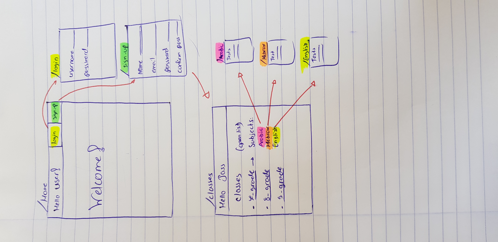

# OnlineTestClasses
Online test class by Enass Jasmine Loreen and Hoda

Our web app gives the students simulation tests.

We will have the following endpoints: 
/register => for the signup page 
/class => for the grades page 
/seventhGrade => for the Arabic, Hebrew and English tests 
/eightGrade => for the Arabic, Hebrew and English tests 
/ninethGrade =>for the Arabic, Hebrew and English tests 

Project's action items:
* When the student logs in, the app will set cookies, and when the user logs out, cookies will be powered off. 
* When the student clicks on his class, it will open the test's list. 
* We use joi validation for the login and the signUp files. 
* The username and its password will be saved in our database.

